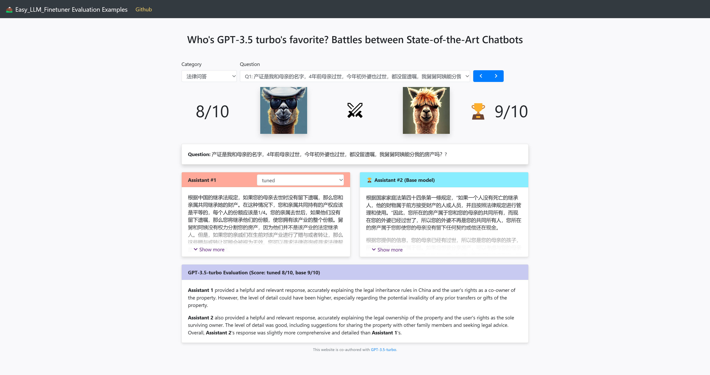

<p align="center">
    
</p>

# Easy-LLM-Evaluator: One-Click AI-enhanced Evaluation of Model Training Effectiveness for LLM Finetuning


This project streamlines the process of evaluating and comparing the performance of base and fine-tuned machine learning models. It automatically generates test questions using GPT, obtains responses from the models, assesses these responses using a GPT model, and produces a score indicating the model's effectiveness. The evaluation results are then transformed into a format suitable for web-based visualization. This project enables rapid, consistent, and automated evaluation of language models, providing data-driven insights for model training and fine-tuning."

## Usage

First, install the required dependencies:

```bash
pip install -r requirements.txt
```

Then, update the run_eval.sh script with your specific model and project details:

```bash
export BASE_MODEL_PATH="/path/to/base_model"
export TUNED_MODEL_PATH="/path/to/tuned_model"
export BASE_MODEL_NAME="base_model_name"
export TUNED_MODEL_NAME="tuned_model_name"
export PROJECT_NAME="project_name"
export CATEGORY="category"
```

Replace the placeholder values with your own corresponding data:

```bash
BASE_MODEL_PATH: Set the path to the base model
TUNED_MODEL_PATH: Set the path to the tuned model
BASE_MODEL_NAME: Set the name of the base model
TUNED_MODEL_NAME: Set the name of the tuned model
PROJECT_NAME: Set the name of the project
CATEGORY: Set the category
```

Finally, run the one-click evaluation script:

```bash
. eval/script/run_eval.sh
```

## Workflow
1. **Extract Subset from Source Test Data**: The script uses a random or stratified sampling method to draw a representative subset from the source test dataset.
2. **Generate Test Questions with GPT**: The chosen subset serves as a seed for the GPT model to generate additional test questions, thereby expanding the test dataset.
3. **Answer Generation by Base and Fine-tuned Models**: Both the base model and the fine-tuned model use the extended test dataset to generate corresponding answers.
4. **Performance Evaluation by GPT**: The answers generated by both models are evaluated by the GPT model. This evaluation produces a score that represents the effectiveness of each model.
5. **Visualize Review Result**: The evaluation and scoring data is processed and transformed into a format suitable for displaying on a frontend website.

## Extract Subset from Source Test Data

A carefully curated subset of the source test data is drawn using random or stratified sampling techniques to represent the diversity of the data. This subset serves as the seed data for the GPT model to generate test questions.

```bash
Easy-LLM-Evaluator
    └─ eval
        └─ table
            └─ input
                └─ vicuna-7b-law
                    └─ source_data.json
```

## Generate Test Questions with GPT

The GPT model uses the seed data to generate a broad range of test questions, effectively expanding the diversity of the test dataset. The questions generated during this stage assess the models' comprehension, contextual understanding, and response generation capabilities.

```bash
Easy-LLM-Evaluator
    └─ eval
        └─ table
            └─ question
                └─ vicuna-7b-law
                    └─ example_questions.json
                    └─ questions.jsonl
```
## Answer Generation by Base and Fine-tuned Models

The base and fine-tuned models process the test questions to generate responses. These responses are then used to compare and evaluate the performance of the models, providing a direct measure of the effectiveness of the fine-tuning process.

```bash
Easy-LLM-Evaluator
    └─ eval
        └─ table
            └─ answer
                └─ vicuna-7b-law
                    └─ answer_vicuna-7b-CrimeKGAssitantClean.jsonl
                    └─ answer_vicuna-7b.jsonl
```

## Performance Evaluation by GPT
The answers generated by both the base and the fine-tuned models are fed into a GPT model for evaluation. This process produces a quantitative score that reflects each model's performance and effectiveness.

```bash
Easy-LLM-Evaluator
    └─ eval
        └─ table
            └─ review
                └─ vicuna-7b-law
                    └─ review_vicuna-7b-CrimeKGAssitantClean_vicuna-7b.jsonl
```
## Visualize Review Result

The evaluation and scoring data is transformed into a format suitable for visualization on a frontend web interface. This step helps to translate complex performance metrics into easy-to-understand visual data, providing a comprehensive overview of the models' performance.

<p align="center">
    
</p>


