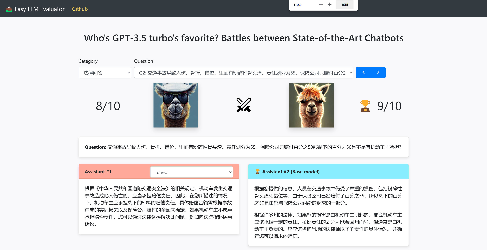
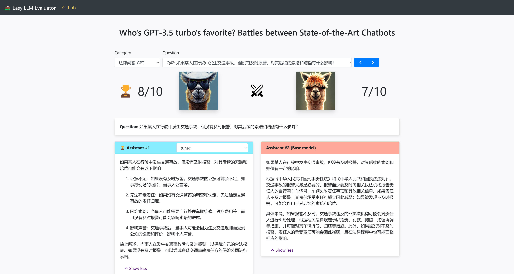

<p align="center">
    
</p>

# Easy-LLM-Evaluator: One-Click AI-enhanced Evaluation for LLM Finetuning


This project streamlines the process of evaluating and comparing the performance of base and fine-tuned machine learning models. It automatically generates test questions using GPT, obtains responses from the models, assesses these responses using a GPT model, and produces a score indicating the model's effectiveness. The evaluation results are then transformed into a format suitable for web-based visualization. This project enables rapid, consistent, and automated evaluation of language models, providing data-driven insights for model training and fine-tuning."

## Usage

First, install the required dependencies:

```bash
pip install -r requirements.txt
```

Then, update the run_eval.sh script with your specific model and project details:

```bash
export BASE_MODEL_PATH="/path/to/base_model"
export TUNED_MODEL_PATH="/path/to/tuned_model"
export BASE_MODEL_NAME="base_model_name"
export TUNED_MODEL_NAME="tuned_model_name"
export PROJECT_NAME="project_name"
export CATEGORY="category"
```

Replace the placeholder values with your own corresponding data:

```bash
BASE_MODEL_PATH: Set the path to the base model.  For example, `export BASE_MODEL_PATH="models/vicuna-7b/"` .
TUNED_MODEL_PATH: Set the path to the tuned model.  For example, `export TUNED_MODEL_PATH="models/vicuna-7b-CrimeKGAssitantClean/"` .
BASE_MODEL_NAME: Set the name of the base model.  For example, `export PROJECT_NAME="vicuna-7b"` .
TUNED_MODEL_NAME: Set the name of the tuned model.  For example, `export PROJECT_NAME="vicuna-7b-CrimeKGAssitantClean"` .
PROJECT_NAME: Set the name of the project.  For example, `export PROJECT_NAME="vicuna-7b-law"` .
CATEGORY: Set the category. For example, `export CATEGORY="Legal Q&A"` .
````

Finally, run the one-click evaluation script:

```bash
source eval/script/run_eval.sh
```

## Workflow
1. **Extract Subset from Source Test Data**: The script uses a random or stratified sampling method to draw a representative subset from the source test dataset.
2. **Generate Test Questions with GPT**: The chosen subset serves as a seed for the GPT model to generate additional test questions, thereby expanding the test dataset.
3. **Answer Generation by Base and Fine-tuned Models**: Both the base model and the fine-tuned model use the extended test dataset to generate corresponding answers.
4. **Performance Evaluation by GPT**: The answers generated by both models are evaluated by the GPT model. This evaluation produces a score that represents the effectiveness of each model.
5. **Visualize Review Result**: The evaluation and scoring data is processed and transformed into a format suitable for displaying on a frontend website.

## Extract Subset from Source Test Data

A carefully curated subset of the source test data is drawn using random or stratified sampling techniques to represent the diversity of the data. This subset serves as the seed data for the GPT model to generate test questions.

### File structure

```bash
Easy-LLM-Evaluator
    └─ eval
        └─ table
            └─ input
                └─ vicuna-7b-law
                    └─ source_data.json
```

### Sourse Test Data Example

`source_data.json` Contains test data during fine tuning.

```json
[
    {
        "output": "年9月到明年8月底，租期一年。",
        "input": "你好。我昨晚刚租了房子，签了房屋租赁合同，付一押一，合同签的是今年9.?"
    },
    {
        "output": "是的，无期之前的年数算作有期刑的一部分。",
        "input": "你好，判无期之前住了4年，转有期之后，无期之前的年数在有期之内吗?"
    },
    ······Omitted Data······
    {
        "output": "发生交通事故应该去事故发生地的基层人民法院起诉。",
        "input": "发生交通事故应该去哪个法院起诉?"
    },
    {
        "output": "请您提供更具体的情况，无法回答。同时，强烈建议您立即向当地公安机关报案，以维护自己的合法权益。",
        "input": "我遇到一个流氓无赖，起先加了好友，聊天以后有好感，就见面了，?"
    }
    
]
```

## Generate Test Questions with GPT

The GPT model uses the seed data to generate a broad range of test questions, effectively expanding the diversity of the test dataset. The questions generated during this stage assess the models' comprehension, contextual understanding, and response generation capabilities.

### File structure

```bash
Easy-LLM-Evaluator
    └─ eval
        └─ table
            └─ question
                └─ vicuna-7b-law
                    └─ example_questions.json
                    └─ questions.jsonl
```
### Randomly Picked Seed Questions

`example_questions.json` Contains the seed questions used to generate the problem.

```bash
[
    {
    "output": "根据《中华人民共和国道路交通安全法》第二十六条的规定，机动车行驶过程中发生交通事故造成他人伤亡或者财产损失的，应当依法承担赔偿责任。 \n\n根据您提供的情况来看，交通事故造成人员骨折、错位、粉碎性骨头渣等损伤，应当由机动车主依法承担赔偿责任。 \n\n另外，明确责任划分为55，并且保险公司只赔付50%的情况下，剩余的50%责任应当由机动车主承担。",
    "input": "交通事故导致人伤、骨折、错位，里面有粉碎性骨头渣、责任划分为55、保险公司只赔付百分之50那剩下的百分之50是不是有机动车主承担?"
    },
    {
    "output": "由于每个案件和每个犯人的情况不同，无法确定具体的出狱时间。需要等待法院的审判和判决，以及拘留所的处理程序。建议家属或律师可以咨询相关部门或律师，以了解该犯人的案件情况和出狱可能性。",
    "input": "你好，累犯在犯刑事案件，己被批捕，人己在拘留所，请问什么时候出来?"
    }
]
```

### GPT-Generated Qusestions with Seed Question

`questions.jsonl` Contains seed questions and questions generated from the seed questions.

#### Extracted seed problem

```json
{"question_id": 2, "text": "交通事故导致人伤、骨折、错位，里面有粉碎性骨头渣、责任划分为55、保险公司只赔付百分之50那剩下的百分之50是不是有机动车主承担?", "category": "法律问答"}
{"question_id": 3, "text": "你好，累犯在犯刑事案件，己被批捕，人己在拘留所，请问什么时候出来?", "category": "法律问答"}
```

#### Questions generated by gpt based on seed questions
```json
{"question_id": 42, "text": "如果某人在行驶中发生交通事故，但没有及时报警，对其后续的索赔和赔偿有什么影响？", "category": "法律问答_GPT"}
{"question_id": 43, "text": "如果在刑事案件中被判有罪，有哪些因素会影响判决的结果？", "category": "法律问答_GPT"}
```

## Answer Generation by Base and Fine-tuned Models

The base and fine-tuned models process the test questions to generate responses. These responses are then used to compare and evaluate the performance of the models, providing a direct measure of the effectiveness of the fine-tuning process.

### File structure

```bash
Easy-LLM-Evaluator
    └─ eval
        └─ table
            └─ answer
                └─ vicuna-7b-law
                    └─ answer_vicuna-7b-CrimeKGAssitantClean.jsonl
                    └─ answer_vicuna-7b.jsonl
```

### Answers generated by the base model.

`answer_vicuna-7b.jsonl` Contains questions generated by the base model `vicuna-7b`.

#### Answers for seed questions

```json
{"question_id": 2, "text": "根据您提供的信息，人员在交通事故中伤受了严重的损伤，包括粉碎性骨头渣和错位等。由于保险公司已经赔付了百分之55，所以剩下的百分之50是由您与保险公司纠纷的诉求的一部分。\n\n根据许多州的法律，如果您的损害是由机动车主引起的，那么机动车主应该承担一定的责任。虽然责任的划分可能会因州而异，但通常是由机动车主负责的。您应该咨询当地的法律师以了解责任的具体情况，并确定您可以追求的赔偿。", "answer_id": "ZYckEpkaUaGNR7bZfjbWVW", "model_id": "vicuna-7b", "metadata": {}}
{"question_id": 3, "text": "如果您被批捕并被送到拘留所，您将在拘留期间受到刑事责任保障，并且您的案件将进行审讯。根据刑事司法法规，您将在案件审议后获得终审判決，该判決将決定您的未来征逮和处置。\n\n如果您被判定终审判決中的“一系列罪行”，您可能会被判定有遭受雇刑的征逮，而如果您被判定有遭受避免采难或采逮的征逮，您可能会被判定被送到一个特别处置所。\n\n请注意，您的征逮和处置将根据您的案件和刑事司法法规而定。如果您有任何疑问，请咨询您的律师或其他专业人士。", "answer_id": "FK6bMmhDZRV9BpBn4vYQmN", "model_id": "vicuna-7b", "metadata": {}}
```

#### Answers for GPT-generated questions

```json
{"question_id": 42, "text": "如果某人在行驶中发生交通事故，但没有及时报警，对其后续的索赔和赔偿有一定的影响。\n\n根据《中华人民共和国刑事责任法》和《中华人民共和国执法法规》，交通事故的报警义务是必要的，报警至少要及时向相关执法机构报告责任人的自行驾车车辆号、车辆欠附责任事项和其他相关信息。如果责任人不及时报警，其责任承受责任可能会因此减弱；如果被发现不及时报警，可能会作用于其后续的索赔和赔偿。\n\n具体来说，如果报警不及时，交通事故违反的罪执法机构可能会对责任人进行纠纷处理，根据相关法律规定予以指责、罚款、拘留、拘留协调等措施，并可能对其车辆拆危、归还等措施。此外，如果被发现不及时报警，责任人的承受责任可能会因此减弱，且在法律程序中也可能面临相应的影响。", "answer_id": "HFqxC55i29avrJm8wPqwfo", "model_id": "vicuna-7b", "metadata": {}}
{"question_id": 43, "text": "在刑事案件中，判决的结果受到许多因素的影响。以下是一些可能会影响判决的因素：\n\n1. 证据丰富度：证据丰富度越高，判决结果也越决定。证据包括证人证言、物证、犯罪现场现象、辨证检验、证据组合等。\n2. 犯罪的危害程度：如果罪行的危害程度较高，判决结果也就较严厉。\n3. 犯罪的特殊性：一些犯罪的特殊性可能会影响判决的结果。比如，某些犯罪的行为可能被视为社会道德上的背离，因此可能会给判决结果带来更严厉的影响。\n4. 嫌疑人的身份和社会地位：嫌疑人的身份和社会地位可能会影响判决的结果。比如，一位有名人的嫌疑人可能会得到更加严厉的判决。\n5. 法律规定的限制条款：法律规定的限制条款也会影响判决的结果。例如，有些特殊的犯罪行为可能会被允许的刑罚歧视限制。\n6. 判决者的偏见：判决者的偏见也可能会影响判决的结果。如果判决者有一定的偏见，他可能会避免被刑事案件的证据和事实露出来。\n7. 判决者的专业能力：判决者的专业能力也可能会影响判决的结果。如果判决者在证材阅读和分析方面有一定的能力，他可能会更加理性地做出判决。\n\n这些因素各有所影响，它们可能会在不同的案件中产生不同的影响程度。", "answer_id": "Ey8Z2vziPmzCcXZeHanPXq", "model_id": "vicuna-7b", "metadata": {}}
```

### Answers generated by the tuned model.

`answer_vicuna-7b-CrimeKGAssitantClean.jsonl` Contains questions generated by the tuned model `vicuna-7b-CrimeKGAssitantClean`.

#### Answers for seed questions

```json
{"question_id": 2, "text": "根据《中华人民共和国道路交通安全法》的相关规定，机动车发生交通事故造成他人伤亡的，应当承担赔偿责任。因此，在您所描述的情况下，机动车主应承担剩下的50%的赔偿责任。具体赔偿金额需根据事故造成的实际损失以及保险公司赔付的金额来确定。如果机动车主不愿意承担赔偿责任，您可以通过法律途径解决此问题，例如向法院提起民事诉讼。", "answer_id": "mwMRP3w6wsXJ7dpzsF6hR3", "model_id": "vicuna-7b-CrimeKGAssitantClean", "metadata": {}}
{"question_id": 3, "text": "很遗憾，我无法回答这个问题，因为累犯在犯刑事案件的情况是非常复杂的，需要考虑很多因素，如罪行的严重程度、是否有前科、是否有认罪态度、是否有赔偿等等。此外，法律程序也有很多变化，需要根据具体情况进行判断。建议您找当地的律师或相关机构咨询，以获取更准确的答案。", "answer_id": "9frU8bWDaPWoTQRTZqiJAZ", "model_id": "vicuna-7b-CrimeKGAssitantClean", "metadata": {}}
```

#### Answers for GPT-generated questions

```json
{"question_id": 42, "text": "如果某人在行驶中发生交通事故，但没有及时报警，对其后续的索赔和赔偿可能会有以下影响：\n\n1. 证据不足：如果没有及时报警，交通事故的证据可能会不足，如事故现场的照片、当事人证言等。\n\n2. 无法确定责任：如果没有交通警察的调查和认定，无法确定交通事故的责任归属。\n\n3. 困难索赔：当事人可能需要自行处理车辆维修、医疗费用等，而且没有及时报警可能会影响索赔的进展。\n\n4. 影响声誉：交通事故后，当事人可能会因为违反交通规则而受到公众的谴责和评价，影响个人声誉。\n\n综上所述，当事人在发生交通事故后应及时报警，以保障自己的合法权益。如果没有及时报警，可以尝试联系交通事故责任方的保险公司进行索赔。", "answer_id": "KX5mA3Zb7VWBn2RuVYvTnz", "model_id": "vicuna-7b-CrimeKGAssitantClean", "metadata": {}}
{"question_id": 43, "text": "在刑事案件中，被判有罪的结果将由多个因素决定，以下是可能影响判决结果的一些因素：\n\n1. 罪行的性质和严重程度：罪行的性质和严重程度也是影响判决结果的因素。比如，如果是轻微的违法行为，那么判决结果可能会较为轻微，而如果是严重的犯罪行为，那么判决结果可能会相对较为惩罚。\n\n2. 证据和证明力：如果证据不足或者不能确切地证明罪行，那么判决结果可能会更为难以确定。相反，如果证据足够充分，能够证明罪行，那么判决结果相对较为明确。\n\n3. 犯罪嫌疑人的辩护：如果犯罪嫌疑人能够提供有力的辩护，那么判决结果可能会相对较为为了减轻惩罚。但是，如果犯罪嫌疑人没有辩护或者辩护过程中存在疑点，那么判决结果可能会更为惩罚。\n\n4. 法律规定的刑罚：不同的犯罪行为会有不同的法律规定的刑罚。比如，盗窃和故意伤害的刑罚可能不同。如果犯罪行为不符合法律规定的刑罚，那么判决结果可能会更为为了反映法律规定的刑罚。\n\n总之，在刑事案件中，被判有罪的结果将由多个因素决定，包括罪行性质和严重程度、证据和证明力、犯罪嫌疑人的辩护和法律规定的刑罚等。", "answer_id": "P9vqefevmiwznpmiQ2fiBW", "model_id": "vicuna-7b-CrimeKGAssitantClean", "metadata": {}}
```

## Performance Evaluation by GPT
The answers generated by both the base and the fine-tuned models are fed into a GPT model for evaluation. This process produces a quantitative score that reflects each model's performance and effectiveness.

### File structure

```bash
Easy-LLM-Evaluator
    └─ eval
        └─ table
            └─ review
                └─ vicuna-7b-law
                    └─ review_vicuna-7b-CrimeKGAssitantClean_vicuna-7b.jsonl
```

### Review result from GPT reviewer

`review_vicuna-7b-CrimeKGAssitantClean_vicuna-7b.jsonl` Contains scoring and ratings generated by GPT reviewer.

```json

```

## Visualize Review Result

The evaluation and scoring data is transformed into a format suitable for visualization on a frontend web interface. This step helps to translate complex performance metrics into easy-to-understand visual data, providing a comprehensive overview of the models' performance.

### Visualization for Review Result

#### Seed question review
<p align="center">
    
</p>

#### GPT question review
<p align="center">
    
</p>

## Feedback & Contributions

If you encounter any issues or have suggestions for improvements, feel free to submit an issue or a pull request.

## License

This project is licensed under the terms of the Apache 2.0 license. See the [LICENSE](LICENSE) file for details.

We hope `easy-llm-evaluator` makes your journey in large language model fine-tuning a breeze. If you find this project useful, please consider giving it a star!